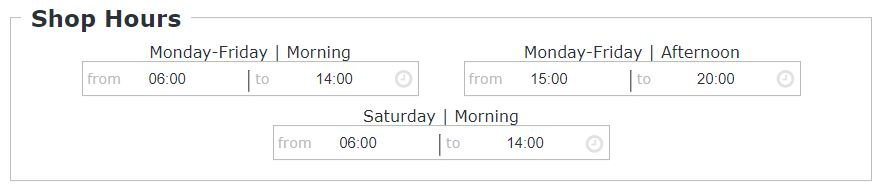
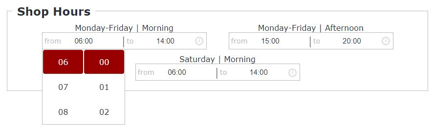
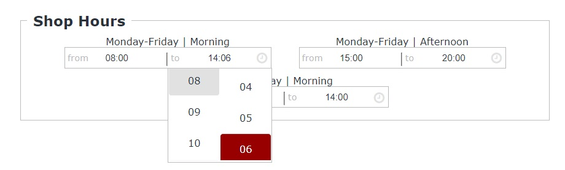

# ShopHours configurator

  ShopHours configurator has been implemented to enter the opening and closing times of your shop.
  
  
  
  
  
  
  
  [](https://github.com/MarioSenese/ShopHours/blob/main/LICENSE)
  
  [](https://www.npmjs.com/package/@mariosenese/shophours)
  [](https://www.npmjs.com/package/@mariosenese/shophours)


##  Install
  ```
  $ npm install @mariosenese/shophours
  ```
##  Usage
Call external js and css files, into header:
```html
<head>
    <script src="js/index.js" async></script>
    <link href="css/style.css" rel="stylesheet" type="text/css" />
</head>
```
  Insert html code in your page:
    
```html
<div id="hours" >
    <fieldset>
      <legend>Shop Hours</legend>
        <div class="shops">
            <div class="h monday friday">
                <div class="morning">
                    <span class="from">
                        <input type="text" class="time" value="06:00" readonly />
                    </span>
                    <span class="to">
                        <input type="text" class="time" value="14:00" readonly />                                
                    </span>
                </div>
                <div class="afternoon">
                    <span class="from">
                        <input type="text" class="time" value="15:00" readonly />
                    </span>
                    <span class="to">
                        <input type="text" class="time" value="20:00" readonly />                                
                    </span>
                </div>
            </div>
            <div class="h saturday">
                <div class="morning">
                    <span class="from">
                        <input type="text" class="time" value="06:00" readonly />                                
                    </span>
                    <span class="to">
                        <input type="text" class="time" value="14:00" readonly />                                
                    </span>
                </div>
            </div>
        </div>
    </fieldset>
</div>
```


  Note: It has been used normally
  ```html
  <input type="text" ... />
  ```
  and not the classic
   ```html
    <input type="time" ... />
  ```

### Screenshot - ShopHours configurator



